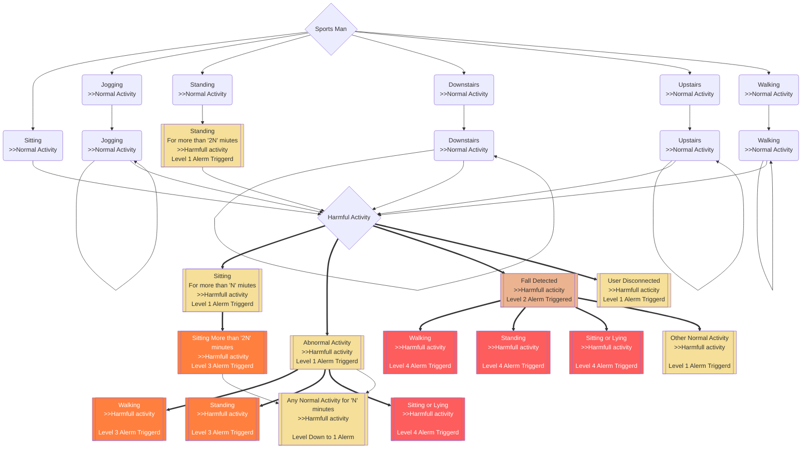

# Defining Alerm

```mermaid
    flowchart
        classDef LevelOne fill:#F5DF99;
        classDef LevelTwo fill:#ECB390;
        classDef LevelThree fill:#FF7F3F,color:#fff;
        classDef LevelFour fill:#FD5D5D,color:#fff;

        0{Sports Man} --> 1(Sitting\n>>Normal Activity) & 2(Jogging\n>>Normal Activity) & 3(Standing\n>>Normal Activity) & 4(Downstairs\n>>Normal Activity)
        0 --> 6(Upstairs\n>>Normal Activity) & 7(Walking\n>>Normal Activity)

        8:::LevelOne
        9:::LevelTwo

        2 --> 200(Jogging\n>>Normal Activity) --> 200
        3 --> 300[[Standing\nFor more than '2N' miutes\n >>Harmfull activity\nLevel 1 Alerm Triggerd]]:::LevelOne

        4 --> 400(Downstairs\n>>Normal Activity) --> 400
        6 --> 600(Upstairs\n>>Normal Activity) --> 600
        7 --> 700(Walking\n>>Normal Activity) --> 700

        H ==> 100[[Sitting\nFor more than 'N' miutes\n >>Harmfull activity\nLevel 1 Alerm Triggerd]]:::LevelOne
        H{Harmful Activity} ==> 8[[Abnormal Activity \n >>Harmfull activity\nLevel 1 Alerm Triggerd]]
        H ==> 9[[Fall Detected \n >>Harmfull acticity\n Level 2 Alerm Triggered]]
        H ==> H2[[User Disconnected \n>>Harmfull acticity\nLevel 1 Alerm Triggerd]]:::LevelOne

        1 --> H
        200 --> H
        300 --> H
        400 --> H
        600 --> H
        700 --> H

        100 ==> 101[[Sitting More than '2N' minutes\n >>Harmfull activity\nLevel 3 Alerm Triggerd]]:::LevelThree
        8 ==> 800[[Walking \n>>Harmfull activity\n\nLevel 3 Alerm Triggerd]]:::LevelThree
        8 ==> 801[[Standing \n>>Harmfull activity\n\nLevel 3 Alerm Triggerd]]:::LevelThree
        8 ==> 802[[Sitting or Lying \n>>Harmfull activity\n\nLevel 4 Alerm Triggerd]]:::LevelFour

        9 ==> 900[[Walking \n>>Harmfull activity\n\nLevel 4 Alerm Triggerd]]:::LevelFour
        9 ==> 901[[Standing \n>>Harmfull activity\n\nLevel 4 Alerm Triggerd]]:::LevelFour
        9 ==> 902[[Sitting or Lying \n>>Harmfull activity\n\nLevel 4 Alerm Triggerd]]:::LevelFour
        9 ==> 903[[Other Normal Activity \n>>Harmfull activity\n\nLevel 1 Alerm Triggerd]]:::LevelOne


        H1[[Any Normal Activity for 'N' minutes\n>>Harmfull activity\n\nLevel Down to 1 Alerm]]:::LevelOne
        101 --> H1
        8 --> H1

```
