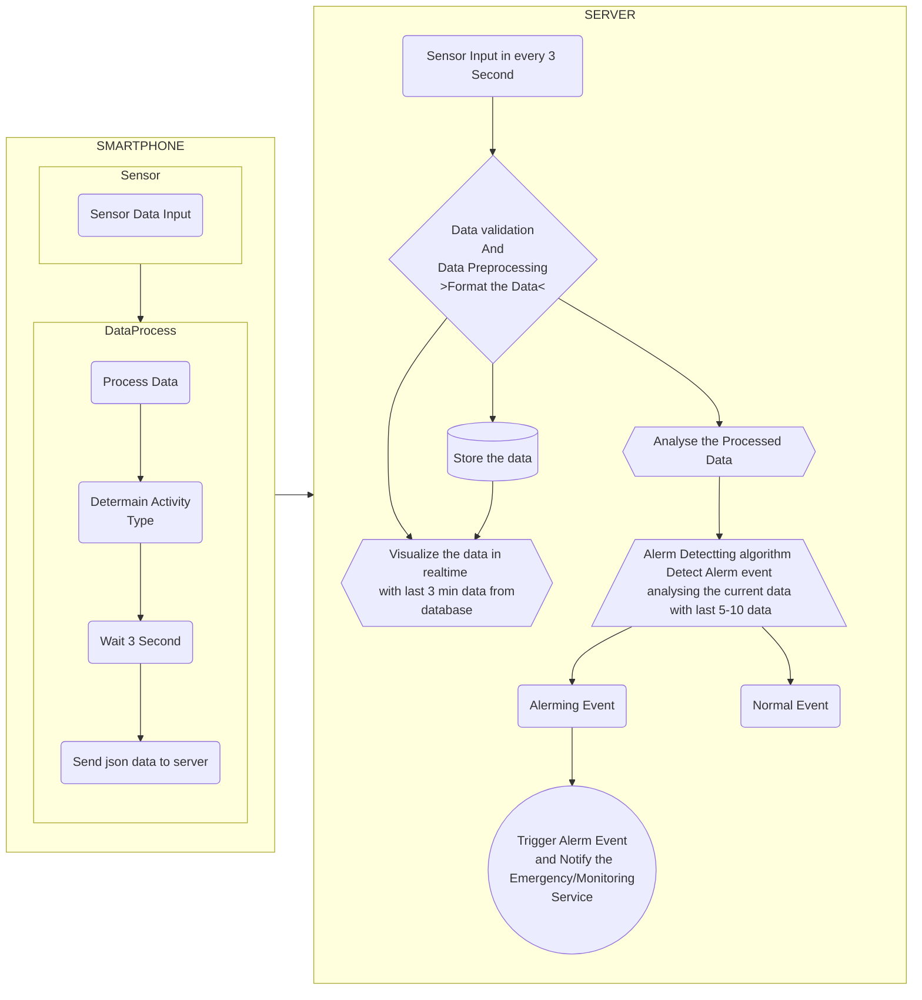

# Higher Level Projet Architecture

## To View this diagram please use mermaid vs code extention or View this page on github / gitlab

```mermaid
    flowchart LR
    subgraph SMARTPHONE
        direction TB
        subgraph Sensor
            SENSOR(Sensor Data Input)
        end
        subgraph DataProcess
            direction TB
            P1(Process Data) -->P2(Determain Activity \nType)
            P2 --> P3(Wait 3 Second)
            P3 -->P4(Send json data to server)
        end
    end
    Sensor --> DataProcess

    subgraph SERVER
    direction TB
        S1(Sensor Input in every 3 Second) --> S2{Data validation \nAnd\n Data Preprocessing\n>Format the Data<}
        S2 --> S4[(Store the data)]
        S2 --> S3{{Visualize the data in realtime \n with last 3 min data from database}}
        S4 --> S3

        S2 --> S5{{Analyse the Processed Data}}

        S5 --> S6[/Alerm Detectting algorithm \n Detect Alerm event analysing the current data\n with last 5-10 data\]
        S6 --> S7(Alerming Event)
        S6 --> S8(Normal Event)

        S7 --> S9((Trigger Alerm Event\n and Notify the\n Emergency/Monitoring Service))

    end

    SMARTPHONE --> SERVER
```
