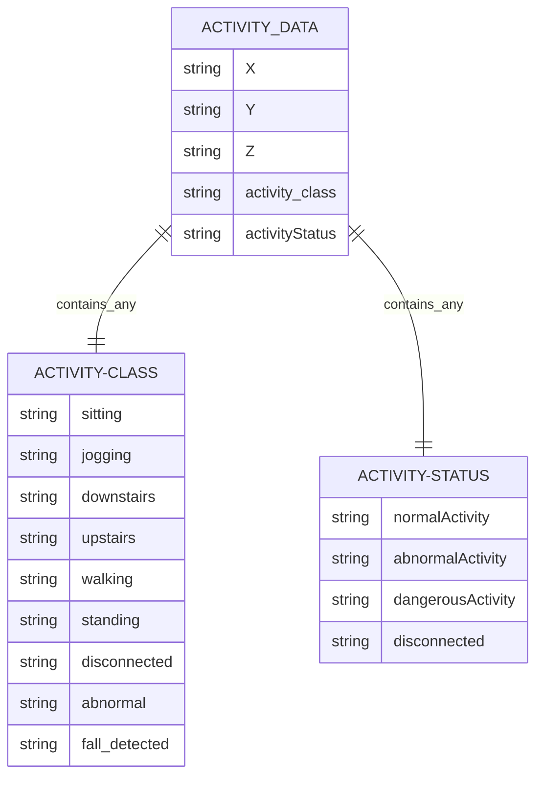

# Type of data That the server aspects

### To View this diagram please use mermaid vs code extention or View this page on github / gitlab

```mermaid
    erDiagram
        ACTIVITY_DATA ||--|| ACTIVITY-CLASS : contains_any
        ACTIVITY_DATA ||--|| ACTIVITY-STATUS : contains_any

            ACTIVITY_DATA {
                string X
                string Y
                string Z
                string activity_class
                string activityStatus
            }

            ACTIVITY-CLASS {
                string sitting
                string jogging
                string downstairs
                string upstairs
                string walking
                string standing
                string disconnected
                string abnormal
                string fall_detected
            }

            ACTIVITY-STATUS {
                string normalActivity
                string abnormalActivity
                string dangerousActivity
                string disconnected
            }
```
