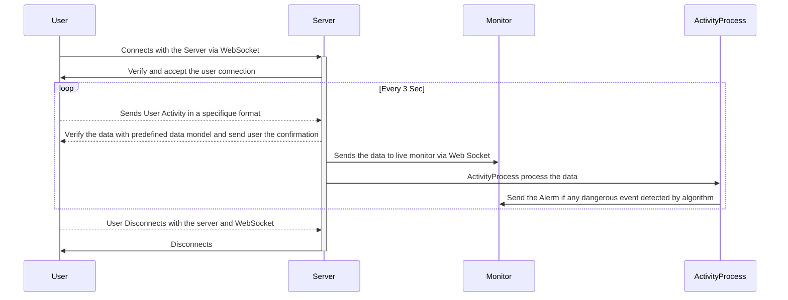

# Sequence Diagram Sports Safety Monitoring

## Overall Sequence

```mermaid
sequenceDiagram
    User->>+Server: Connects with the Server via WebSocket
    Server->>User: Verify and accept the user connection
    loop Every 3 Sec
        User-->>Server: Sends User Activity in a specifique format
        Server-->>User: Verify the data with predefined data mondel and send user the confirmation
        Server->>Monitor: Sends the data to live monitor via Web Socket
        Server->>ActivityProcess: ActivityProcess process the data
        ActivityProcess->>Monitor: Send the Alerm if any dangerous event detected by algorithm
    end

    User-->>Server: User Disconnects with the server and WebSocket
    Server->>-User: Disconnects
```
