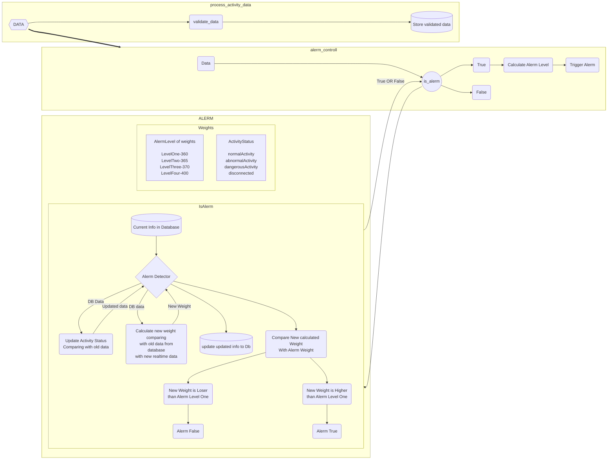

```mermaid
   flowchart LR
   subgraph alerm_controll
      direction TB
        AC1(Data) --> AC2((is_alerm))
        AC2 --> AC3(True) & AC4(False)
        AC3 --> AC5(Calculate Alerm Level)
        AC5 --> AC6(Trigger Alerm)
   end

   subgraph process_activity_data
      direction TB
        D1{{DATA}} --> D2(validate_data) --> D3[(Store validated data)]
   end
   D1 ==> alerm_controll

   subgraph ALERM
      direction LR
      subgraph IsAlerm
         direction TB
         A1{Alerm Detector}
         A2[(Current Info in Database)]
         A3(Update Activity Status\nComparing with old data)
         A2 --> A1
         A3 -->|Updated data| A1
         A1 -->|DB Data| A3
         A4(Calculate new weight comparing\n with old data from database\nwith new realtime data)
         A4 -->|New Weight| A1
         A1 -->|DB data| A4
         A1 --> A5[(update updated info to Db)]
         A1 --> A6(Compare New calculated Weight\nWith Alerm Weight)

         A7(New Weight is Loser \nthan Alerm Level One) --> A9(Alerm False)
         A8(New Weight is Higher \nthan Alerm Level One) --> A10(Alerm True)
         A6 --> A7 & A8

      end

      subgraph Weights
      direction TB
      A11[AlermLevel of weights\n\n LevelOne-360\nLevelTwo-365\nLevelThree-370\nLevelFour-400]
      A12[ActivityStatus\n\n normalActivity\n abnormalActivity\ndangerousActivity\n disconnected]
      end

   end

   IsAlerm -->|True OR False| AC2
   AC2 --> IsAlerm

```
